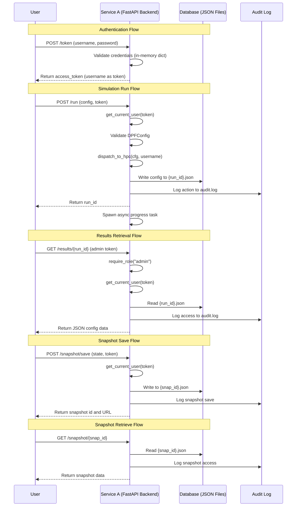

# DPF2 Architecture Analysis and Logic Errors

## Mermaid.js Sequence Diagram



## Critical Logic Errors Identified

### 1. **CRITICAL SECURITY FLAW: Authentication Token is Username**
**Location:** `web/backend/main.py:77`
```python
return {"access_token": user["username"], "token_type": "bearer"}
```

**Error:** The access token returned is literally the username itself. This means:
- No actual token generation or signing occurs
- Anyone who knows a username can authenticate as that user
- No expiration, no cryptographic signing, no secret
- The `get_current_user` function simply looks up the token (username) in the users dict

**Impact:** CRITICAL - Complete authentication bypass

**Fix Required:** Implement proper JWT tokens with signing, expiration, and secret keys

---

### 2. **CRITICAL SECURITY FLAW: Hardcoded Passwords in Plain Text**
**Location:** `web/backend/main.py:38-41`
```python
users = {
    "admin": {"username": "admin", "password": "secret", "role": "admin"},
    "user": {"username": "user", "password": "secret", "role": "user"},
}
```

**Error:** 
- Passwords stored in plain text in source code
- Same password ("secret") for both users
- In-memory user storage (no persistence)
- No password hashing

**Impact:** CRITICAL - Complete credential compromise

**Fix Required:** 
- Use environment variables for credentials
- Hash passwords (bcrypt, argon2)
- Store users in a proper database

---

### 3. **DATA INTEGRITY ISSUE: Results Endpoint Returns Config Instead of Results**
**Location:** `web/backend/main.py:207-213`
```python
@app.get("/results/{run_id}")
def get_results(run_id: str, user=Depends(require_role("admin"))):
    path = UPLOAD_DIR / f"{run_id}.json"
    if not path.exists():
        raise HTTPException(status_code=404, detail="Run not found")
    logger.info("action=get_results user=%s run_id=%s", user["username"], run_id)
    return json.loads(path.read_text())
```

**Error:** The endpoint is named `/results/{run_id}` but it returns the configuration file, not the simulation results. The `dispatch_to_hpc` function only saves the config:
```python
(UPLOAD_DIR / f"{run_id}.json").write_text(cfg.model_dump_json())
```

**Impact:** HIGH - API contract violation, users cannot retrieve actual simulation results

**Fix Required:** Either:
- Rename endpoint to `/config/{run_id}` to match actual behavior
- Implement actual results storage and retrieval
- Create separate endpoints for config vs results

---

### 4. **LOGIC ERROR: No Actual HPC Dispatch**
**Location:** `web/backend/main.py:199-204`
```python
def dispatch_to_hpc(cfg: DPFConfig, username: str) -> str:
    run_id = f"run-{int(datetime.utcnow().timestamp())}"
    UPLOAD_DIR.mkdir(parents=True, exist_ok=True)
    (UPLOAD_DIR / f"{run_id}.json").write_text(cfg.model_dump_json())
    # Placeholder for real HPC dispatch
    return run_id
```

**Error:** 
- Function is named `dispatch_to_hpc` but does not dispatch anything
- Only saves config to filesystem
- Comment admits it's a placeholder
- Async progress task uses mock data, not real simulation

**Impact:** MEDIUM - Misleading function name, no actual simulation execution

**Fix Required:** Either implement HPC dispatch or rename to `save_config`

---

### 5. **RACE CONDITION: WebSocket Client Sets Modified During Iteration**
**Location:** `web/backend/main.py:103-105, 108-110, 113-117, 120-122`
```python
async def broadcast_progress(run_id: str, progress: float) -> None:
    for ws in list(progress_clients.get(run_id, set())):
        await ws.send_json({"run_id": run_id, "progress": progress})
```

**Error:** While `list()` is used to prevent modification during iteration, the actual client sets can be modified by other coroutines (add/remove in websocket handlers). This creates a race condition.

**Impact:** LOW-MEDIUM - Potential runtime errors if clients disconnect during broadcast

**Fix Required:** Use locks or ensure atomic operations

---

### 6. **NO AUTHENTICATION ON SNAPSHOT RETRIEVAL**
**Location:** `web/backend/main.py:232-238`
```python
@app.get("/snapshot/{snap_id}")
async def get_snapshot(snap_id: str):
    path = SNAPSHOT_DIR / f"{snap_id}.json"
    if not path.exists():
        raise HTTPException(status_code=404, detail="Snapshot not found")
    logger.info("action=get_snapshot id=%s", snap_id)
    return json.loads(path.read_text())
```

**Error:** 
- No `user=Depends(get_current_user)` parameter
- Anyone can access any snapshot without authentication
- Only logging occurs, but no access control

**Impact:** MEDIUM - Unauthorized data access

**Fix Required:** Add authentication dependency

---

### 7. **INSECURE FILE UPLOAD: No Validation**
**Location:** `web/backend/main.py:241-245`
```python
@app.post("/snapshot/upload")
async def upload_snapshot(file: UploadFile = File(...)):
    """Load a snapshot from a user-uploaded JSON file."""
    data = json.loads(await file.read())
    return data
```

**Error:**
- No authentication required
- No file size limit
- No content type validation
- Directly parses JSON without try/except
- Can cause DoS with large files or malformed JSON

**Impact:** MEDIUM - DoS vulnerability, no access control

**Fix Required:** Add authentication, file size limits, error handling, content validation

---

### 8. **PREDICTABLE IDENTIFIERS: Timestamp-Based IDs**
**Location:** `web/backend/main.py:200, 225`
```python
run_id = f"run-{int(datetime.utcnow().timestamp())}"
snap_id = f"snap-{datetime.utcnow().timestamp():.0f}-{len(req.state)}"
```

**Error:**
- Run IDs and snapshot IDs are predictable
- Based on timestamp makes them guessable
- Snapshot ID includes state size, leaking information
- Allows enumeration attacks

**Impact:** LOW-MEDIUM - Information disclosure, enumeration attacks

**Fix Required:** Use UUID4 or cryptographically secure random IDs

---

### 9. **INCOMPLETE ERROR HANDLING: File Operations**
**Location:** Multiple file read/write operations

**Error:** File operations lack proper error handling:
- `path.read_text()` can fail with various IOErrors
- `path.write_text()` can fail with permission errors
- No disk space checks
- No validation of path traversal attempts

**Impact:** MEDIUM - Application crashes, potential security issues

**Fix Required:** Add try/except blocks and validate paths

---

### 10. **NO RATE LIMITING**
**Location:** All endpoints

**Error:**
- No rate limiting on any endpoint
- Allows brute force attacks on login
- Allows DoS through repeated requests
- No throttling on expensive operations

**Impact:** MEDIUM - DoS vulnerability, brute force attacks

**Fix Required:** Implement rate limiting middleware

---

## Summary

### Critical Issues (Fix Immediately)
1. Authentication bypass (token = username)
2. Hardcoded plain-text passwords
3. Results endpoint returns wrong data

### High Priority Issues
4. Missing HPC dispatch implementation
5. No authentication on snapshot retrieval
6. Insecure file upload endpoint

### Medium Priority Issues
7. WebSocket race conditions
8. Predictable identifiers
9. Incomplete error handling
10. No rate limiting

## Architectural Notes

- **No Database:** Despite the task mentioning a "Database", this application uses the filesystem with JSON files for persistence
- **Mock Implementation:** Many features are mocked (HPC dispatch, simulation progress)
- **Single Server:** No distributed architecture, all state in-memory
- **No Session Management:** No proper session storage or management

## Recommendations

1. **Immediate:** Replace authentication system with proper JWT implementation
2. **Short-term:** Add a real database (PostgreSQL/SQLite) for users, sessions, and results
3. **Medium-term:** Implement actual HPC job submission and monitoring
4. **Long-term:** Add comprehensive security middleware (CORS, rate limiting, input validation)
